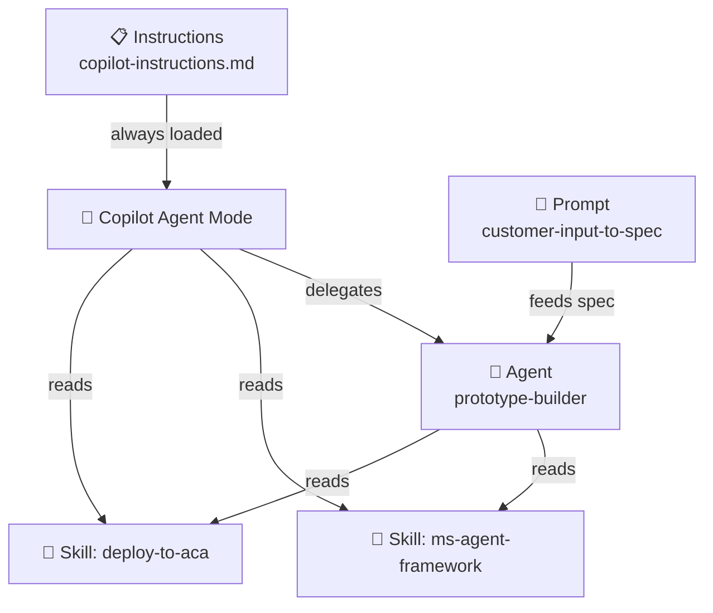

# HVE Primitives

A reference architecture for **Hypervelocity Engineering (HVE)** — the practice of small, expert teams leveraging AI to ship at the pace of innovation without sacrificing quality, security, or scalability.

HVE is not vibe coding. It's about embedding reusable **primitives** — instructions, agents, prompts, and skills — directly into your repo so that GitHub Copilot works *with* your stack, your standards, and your workflow.

> 📖 **[Interactive Architecture Guide](https://valentina-alto.github.io/hve-primitives/architecture.html)** — explore the full primitive catalog, orchestration model, and frontmatter anatomy.

## What's in This Repo

| Primitive | File | Purpose |
|-----------|------|---------|
| 📋 Instructions | `.github/copilot-instructions.md` | Global coding standards (HTML/CSS/JS + Flask, README rules) |
| 🤖 Agent | `.github/agents/prototype-builder.agent.md` | Builds Flask prototypes from specs with synthetic data |
| 💬 Prompt | `.github/prompts/customer-input-to-spec.prompt.md` | Parses customer input into structured, dev-ready specs |
| 🧠 Skill | `.github/skills/ms-agent-framework/SKILL.md` | Scaffolds AI agents using Microsoft Agent Framework |
| 🧠 Skill | `.github/skills/deploy-to-aca/SKILL.md` | Deploys apps to Azure Container Apps with secure defaults |

## How They Wire Together

## Getting Started

1. **Clone** this repo
2. Explore the primitives in `.github/`
3. Open VS Code with GitHub Copilot and start a chat — the instructions, agent, and skills are picked up automatically
4. Try the prompt: type `/customer-input-to-spec` and paste customer notes

## Learn More

- [Interactive Architecture Guide](https://valentina-alto.github.io/hve-primitives/architecture.html)
- [github/awesome-copilot](https://github.com/github/awesome-copilot) — community primitives, hooks, and agentic workflows
